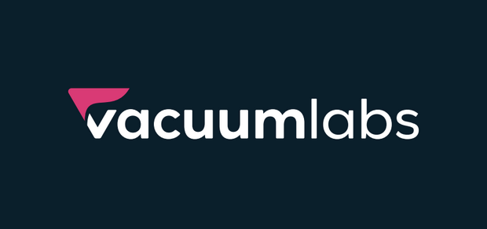

# Programmable Tokens by Vacuumlabs

Welcome to Programmable Tokens research by [Vacuumlabs Auditing](https://vacuumlabs.com/blockchain/smart-contract-auditing/) team.

It is a design research on how to bring programmable on-transfer functionalities to Cardano native tokens. We believe this will help bring exciting new functionalities to Cardano.

  
  
  

  

## Files

* Design [whitepaper](./whitepaper.pdf).

## Feedback

[Join our Discord](https://discord.gg/5XVW2MUdWu). You can ask questions, share
your ideas and discuss anything (not only) programmable tokens' related. Alternatively,
you can share your thoughts and feedback with us at audit@vacuumlabs.com as
well.

## Changelog

This project is ever evolving. Please refer to the [Changelog](./CHANGELOG.md) to see the changes over time.

## License

Licensed under GPL-3.0. Full license text can be found [here](./LICENSE).
